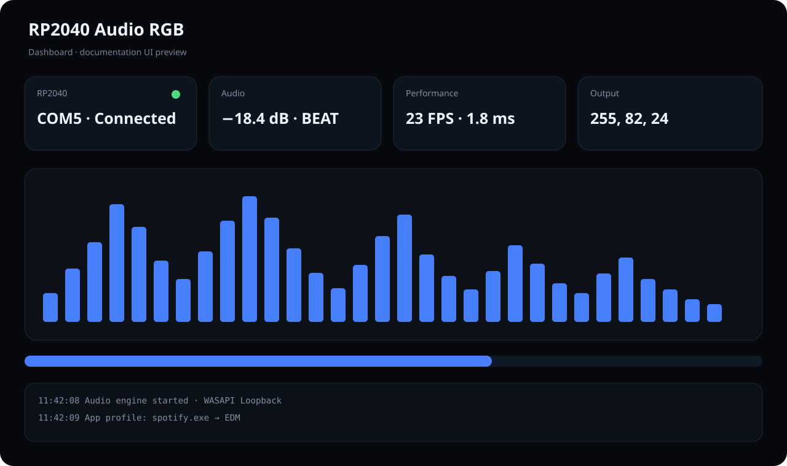
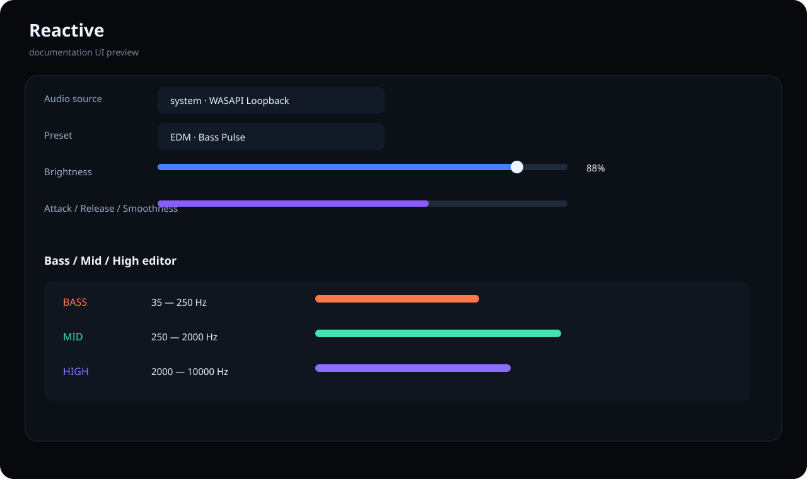
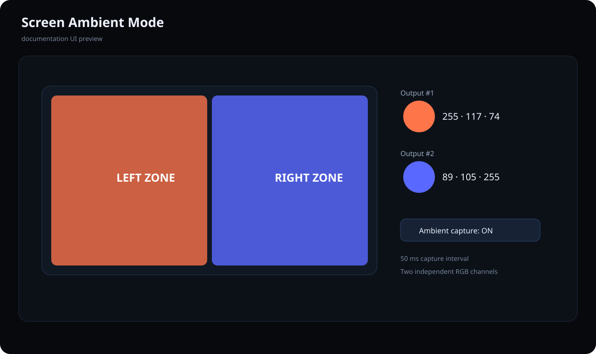

<p align="center">
  
</p>

<h1 align="center">RP2040 Audio RGB</h1>

<p align="center"><b>Windows audio-reactive RGB controller, screen ambient lighting and RP2040 firmware.</b></p>

The project started as a small Python music-lighting script and is now structured as a full Windows desktop application. It captures Windows playback or a microphone, performs real-time FFT/beat analysis, renders RGB effects and drives an RP2040 over USB serial. It can also ignore audio completely and use the screen as a two-zone Ambilight source.

## UI preview

> These SVG images are documentation previews of the implemented interface. They are not claimed to be captured runtime screenshots; real Windows captures can replace them after the first packaged build is tested.







## Highlights

- PySide6 dark desktop GUI with Dashboard, Reactive, Effects, Ambient, App Profiles, RP2040 and Settings tabs
- Windows system audio through WASAPI loopback **or** microphone capture
- selectable audio devices
- live 32-band spectrum visualization
- FFT Bass / Mid / High analysis
- automatic gain control and beat detection
- Spectrum, Bass Pulse, Gradient, Static, Breathing, Pulse and Rainbow modes
- brightness, sensitivity, attack, release and smoothness controls
- editable frequency ranges, gains and colors
- built-in Gaming, EDM, Rock, Chill, Movie and Night presets
- saved custom presets
- automatic preset switching by foreground application
- two-zone screen Ambient Mode
- independent RGB output #1 / #2 modes
- RGB channel calibration and LED test tools
- WS2812 strip count up to 300 pixels in firmware v2
- automatic COM detection/reconnect
- system tray, Windows autostart and global hotkeys
- idle and night modes
- firmware BOOTSEL `.uf2` updater
- protocol v2 device health/status commands
- portable EXE and Inno Setup installer definitions
- tag-driven GitHub Release workflow
- staged portable updater helper
- performance diagnostics and persistent logs

The complete 40-point implementation matrix is in [`docs/FEATURES.md`](docs/FEATURES.md).

## Signal paths

### Audio reactive

```text
Windows playback / microphone
          |
          v
   PyAudioWPatch
          |
          v
FFT + AGC + beat detection
          |
          v
Effect engine / presets
          |
          v
USB Serial 115200
          |
          v
        RP2040
       /      \
 PWM RGB    WS2812
```

### Screen Ambient

```text
Windows screen
     |
     v
  MSS capture
     |
 +---+---+
 |       |
Left   Right
 |       |
RGB #1  RGB #2
```

## Repository structure

```text
RP2040-Audio-RGB/
├─ app.py                         GUI launcher
├─ led.py                         legacy/headless prototype
├─ rgb_app/
│  ├─ audio.py                    WASAPI / microphone / FFT / AGC / beats
│  ├─ ambient.py                  screen capture
│  ├─ config.py                   persisted settings and presets
│  ├─ device.py                   RP2040 serial manager
│  ├─ effects.py                  effect engine
│  ├─ gui.py                      PySide6 application
│  ├─ widgets.py                  spectrum + dark UI
│  └─ windows.py                  hotkeys, profiles, updater, autostart
├─ firmware/RP2040_Audio_RGB/     Arduino RP2040 firmware v2
├─ docs/                          protocol, architecture, guide, previews
├─ assets/icon.svg                application mark
├─ RP2040AudioRGB.spec            PyInstaller build
├─ installer.iss                  Inno Setup installer
└─ .github/workflows/release.yml  Windows Release pipeline
```

## Install from source

Requirements:

- Windows 10/11
- Python 3.10+
- RP2040 board

```bat
git clone https://github.com/kostiantynbryl/RP2040-Audio-RGB.git
cd RP2040-Audio-RGB
setup.bat
run.bat
```

Or manually:

```bat
py -m pip install -r requirements.txt
py app.py
```

## Firmware

Arduino source:

```text
firmware/RP2040_Audio_RGB/RP2040_Audio_RGB.ino
```

Default pins:

```text
R       GP13
G       GP14
B       GP15
WS2812  GP16
```

Change these constants before flashing if your wiring differs. GP16 matches the onboard WS2812 arrangement commonly used by RP2040-Zero style boards.

Firmware v2 understands:

```text
L R1 G1 B1 R2 G2 B2
PING
INFO
BRI 0..100
COUNT 1..300
OFF
```

See [`docs/protocol.md`](docs/protocol.md).

## Build Windows binaries

Portable build:

```bat
build.bat
```

Outputs:

```text
dist\RP2040AudioRGB\RP2040AudioRGB.exe
dist\RP2040AudioRGB-portable.zip
```

Compile `installer.iss` with Inno Setup for a standard Windows installer.

Pushing a tag such as `v1.0.0` triggers the Windows Release GitHub Actions workflow and publishes the generated artifacts to a GitHub Release.

## Default hotkeys

```text
Ctrl+Alt+L       Toggle LEDs
Ctrl+Alt+P       Next preset
Ctrl+Alt+Up      Brightness +10%
Ctrl+Alt+Down    Brightness -10%
```

## Configuration and logs

```text
%APPDATA%\RP2040-Audio-RGB\config.json
%APPDATA%\RP2040-Audio-RGB\app.log
```

## Documentation

- [`docs/USER_GUIDE.md`](docs/USER_GUIDE.md) — usage and build guide
- [`docs/FEATURES.md`](docs/FEATURES.md) — all 40 requested features
- [`docs/ARCHITECTURE.md`](docs/ARCHITECTURE.md) — code and threading architecture
- [`docs/protocol.md`](docs/protocol.md) — serial protocol v2
- [`firmware/README.md`](firmware/README.md) — firmware setup

## Status

**v1.0 development implementation is in `main`.** The next validation milestone is running the new GUI on the target Windows PC, confirming the actual external RGB GPIO wiring, compiling/flashing firmware v2 and replacing the SVG documentation previews with real captured screenshots.

## License

MIT — see [`LICENSE`](LICENSE).
